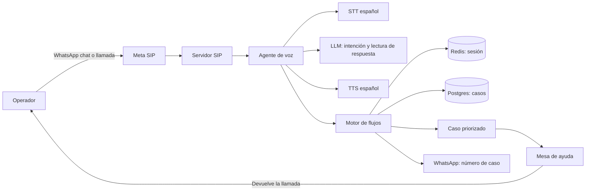
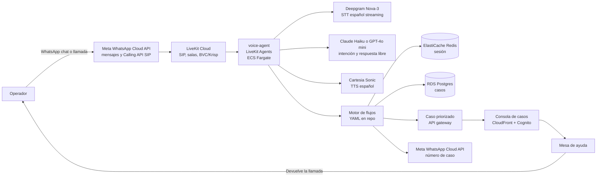

# Análisis: agente de voz para soporte en campo

Qué es el agente de voz, cómo se comporta en una llamada real desde un puesto de inscripción, qué opciones de construcción hay y cuál conviene para el piloto.

Contexto en [analisis.md](analisis.md). Despliegue general en [arquitectura-whatsapp-voip.md](arquitectura-whatsapp-voip.md).

## Qué tiene que hacer

El operador está frente a una tableta que no conecta, no enciende o no lo deja entrar. Llama desde su celular y el agente lo acompaña: le dice un paso, espera a que lo haga, entiende qué pasó y sigue con el siguiente. Si el árbol se agota, abre el caso priorizado para la mesa de ayuda con todo lo que ya se intentó.

## Lo que confirmó el cliente (5 oct 2026)

| Pregunta | Respuesta | Qué cambia |
| --- | --- | --- |
| ¿Con qué se comunica el operador? | Celular con minutos y datos. | Un solo canal: WhatsApp (chat y llamada de voz). |
| ¿La mesa transfiere llamadas? | No. Atiende los casos directamente. | El agente no depende de una transferencia. Escala con un caso priorizado y la mesa devuelve la llamada. |
| ¿El audio puede ir a la nube? | Sí, si no es información sensible. | LiveKit Cloud y proveedores en nube. La huella nunca entra; la cédula no pasa por el modelo. |

No es un IVR de menús ni un chat leído en voz alta. Hay tres cosas que lo hacen distinto:

1. **Espera activa.** Reiniciar una tableta tarda uno o dos minutos. El agente no puede colgar ni tratar el silencio como fin de turno. Dice “avíseme cuando prenda”, se queda callado y cada 20–30 segundos pregunta si ya está.
2. **Manos ocupadas.** El operador tiene la tableta en las manos y el celular en altavoz o en el hombro. Las frases son cortas, una acción por turno, y se puede interrumpir al agente en cualquier momento.
3. **Ruido.** Un puesto de inscripción tiene fila, gente hablando y a veces está en la calle. Cada confirmación acepta voz o teclado: 1 sí, 2 no, 0 hablar con una persona.

## Cómo llega la llamada

El operador usa un solo contacto de WhatsApp para el chat y para la llamada de voz. Meta habilita llamadas iniciadas por el usuario en Colombia y las entrega por SIP a LiveKit. Audio de banda ancha (Opus), sin costo de minutos. El teclado de WhatsApp manda tonos en la llamada, así que la cédula por teclado funciona. Requiere que el número de WhatsApp tenga un límite diario de al menos 2.000 destinatarios.

## Una llamada de “sin internet”

```text
Agente:   Soporte de inscripción. Esta llamada puede quedar registrada.
          ¿Su problema es de ingreso, de internet o de la tableta?
Operador: La tableta no tiene internet.
Agente:   Vamos a revisarlo juntos. Marque su cédula y la tecla numeral.
Operador: [DTMF] 1012345678#
Agente:   Gracias. Deslice desde arriba de la pantalla.
          ¿Ve el ícono de datos móviles encendido?
Operador: Eh… no, está apagado.
Agente:   Tóquelo para encenderlo y espere unos segundos. ¿Ya aparece la señal?
Operador: No.
Agente:   Revise el avión en ese mismo menú. Si está encendido, apáguelo.
Operador: No, el avión está apagado.
Agente:   Entonces reiniciemos. Mantenga presionado el botón de encendido
          y elija Reiniciar. Me quedo en la línea; avíseme cuando prenda.
          [silencio, 25 s]
Agente:   ¿Ya encendió?
Operador: Sí, ya. Ya tiene internet.
Agente:   Perfecto. Queda registrado como resuelto. ¿Algo más?
```

Si después del reinicio no hay conexión:

```text
Agente:   No logramos recuperar la conexión. Dejé un caso prioritario para
          la mesa de ayuda con su puesto y lo que probamos. Su número de
          caso es 4 8 2 1; también se lo mandé por WhatsApp. La mesa lo va
          a llamar a este número.
```

## Escalamiento sin transferencia

Hoy la mesa atiende casos y no transfiere llamadas. El agente se adapta a eso en lugar de pedirle a la mesa una central nueva:

1. El agente cierra la llamada con un caso priorizado: puesto, síntoma, pasos intentados y en cuál falló, número que llamó y resumen de la conversación.
2. Le manda al operador el número de caso por WhatsApp.
3. La mesa ve el caso en su cola y devuelve la llamada como hace hoy.
4. Si el operador vuelve a llamar antes de que lo contacten, el agente reconoce el caso abierto y le dice en qué estado está, sin repetir el diagnóstico.

Prioridad del caso:

| Situación | Prioridad |
| --- | --- |
| Puesto sin poder inscribir (tableta no enciende, sin internet tras el árbol) | Alta |
| Huella no reconocida tras los dedos indicados | Alta, a Dirección de Censo |
| No llegó el correo de credenciales | Media, a Dirección de Censo |
| El operador pidió hablar con una persona sin falla bloqueante | Normal |

La mesa no tiene herramienta de casos. Se propone una consola propia sobre la misma base del agente; detalle y alternativas en [infraestructura.md](infraestructura.md#consola-de-casos).

## Arquitectura recomendada

Cadena en streaming: reconocimiento de voz, modelo y síntesis, cada etapa empezando antes de que termine la anterior. El procedimiento no lo escribe el modelo: vive en el flujo del caso.



### Con tecnologías del piloto

Misma lógica que el diagrama anterior, con los productos concretos:



Versión en imagen: [diagramas/arquitectura-voz-tecnologias.png](diagramas/arquitectura-voz-tecnologias.png).

| Genérico | Tecnología | Qué hace |
| --- | --- | --- |
| Meta SIP | Meta WhatsApp Calling API (SIP) | Recibe chat y llamada de voz que el operador inicia desde WhatsApp y entrega la llamada por SIP al agente. Sin costo de minutos. |
| Servidor SIP | LiveKit Cloud (SIP, salas, BVC/Krisp) | Termina la llamada de WhatsApp, mezcla el audio, cancela ruido de fondo y conecta con el agente de voz. |
| Agente de voz | voice-agent — LiveKit Agents en ECS Fargate | Orquesta cada llamada: escucha, interpreta, habla, lee el teclado y crea el caso. |
| STT español | Deepgram Nova-3 | Convierte en texto, en vivo, lo que dice el operador. |
| LLM | Claude Haiku o GPT-4o mini | Clasifica la intención inicial y traduce la respuesta libre a sí, no, no entendí o quiero una persona. |
| TTS español | Cartesia Sonic | Genera la voz del agente. Los pasos fijos van presintetizados en S3; solo las frases dinámicas se crean en la llamada. |
| Motor de flujos | YAML en el repo | Define el árbol de cada caso: qué paso sigue, cuántos intentos y cuándo escalar. Editable sin tocar código. |
| Redis | ElastiCache Redis | Guarda la sesión activa: teléfono, caso, paso actual e intentos. Permite retomar si se corta la llamada. |
| Postgres | RDS Postgres | Persiste casos, historial enmascarado, flujos y métricas. |
| Caso priorizado | API del gateway | Crea el ticket en la cola de la mesa con puesto, síntoma, pasos intentados y resumen. |
| WhatsApp número de caso | Meta WhatsApp Cloud API | Manda al operador el número de caso por chat al cerrar o escalar la llamada. |
| Mesa de ayuda | Consola — CloudFront + Cognito | Bandeja web donde la mesa ve la cola, toma el caso y llama de vuelta al operador. |

Los audios fijos de cada paso salen de **S3** (presintetizados con Cartesia); las frases dinámicas se generan en vivo. Detalle de despliegue en [infraestructura.md](infraestructura.md).

### Quién decide qué se dice

| Pieza | Hace | No hace |
| --- | --- | --- |
| Motor de flujos | Sabe en qué paso está la llamada, cuántos intentos van y cuándo escalar. Tiene el texto exacto de cada paso. | No interpreta lenguaje. |
| LLM | Clasifica la intención inicial. Traduce “eh, no, sigue igual” a `no`. Detecta “páseme con alguien”. Saca el puesto si lo dicen en voz. | No inventa pasos ni redacta instrucciones técnicas. No recibe la cédula. |
| TTS | Lee el texto del paso. | — |

Las frases de cada paso son fijas, así que se pueden sintetizar una vez y guardar el audio. Eso quita la síntesis de la latencia en la mayoría de los turnos y garantiza que el operador oiga exactamente lo que aprobó el equipo de procesos. Solo las frases dinámicas (número de caso, nombre del puesto) se sintetizan en vivo.

### Herramientas del agente

- `avanzar(resultado)`: sí, no, no entendí, esperar.
- `identificar_operador(cedula)`: por DTMF; el número que llama sirve como pista, no como identidad.
- `crear_caso(tipo, puesto, pasos)` y `registrar_novedad_equipo(serial, puesto)`.
- `escalar(motivo, prioridad)`: deja el caso en la cola de la mesa o de Dirección de Censo, con el resumen ya escrito.
- `consultar_caso(telefono)`: si quien llama ya tiene un caso abierto, le dice en qué va.
- `enviar_whatsapp(plantilla)`: durante la llamada, manda la imagen de dónde está el ícono de avión o el número de caso al cerrar.

### Continuidad

La sesión vive en Redis por número de teléfono, con vencimiento de unas horas. Si la llamada se corta en el paso 3, al volver a llamar el agente pregunta “¿seguimos donde íbamos, en el reinicio?”. Si empezó por chat, la llamada retoma el mismo caso.

## Opciones de construcción

| Opción | Qué es | A favor | En contra | Para qué |
| --- | --- | --- | --- | --- |
| **A. Cadena propia con LiveKit Agents** | Framework abierto con SIP propio, DTMF, transferencia en frío y asistida, cancelación de ruido. STT, LLM y TTS intercambiables. | Control del flujo, texto en cada turno para auditar y enmascarar, cambio de proveedor sin reescribir. Corre en LiveKit Cloud o en la VPC. | Más piezas que operar que una plataforma cerrada. | **Recomendada para el piloto.** |
| B. Cadena propia con Pipecat | Framework abierto, pipeline más bajo nivel. | Muy flexible. | Sin servidor SIP propio; por WebSocket del operador no trae transferencias. Para SIP termina apoyándose en Daily o LiveKit. | Alternativa si el equipo ya lo conoce. |
| C. Voz a voz (gpt-realtime-1.5, Gemini 3.1 Flash Live, Nova 2 Sonic) | Un solo modelo recibe audio y responde audio. | Conversación muy natural, interrupciones finas. Nova 2 Sonic corre en Bedrock y soporta español. | No hay texto intermedio para controlar lo que se dice ni para enmascarar. Más caro por minuto. | Experimento. No para el árbol de pasos. |
| D. Plataforma administrada (Retell, Vapi, ElevenLabs Agents) | Se configura el agente en un panel y se conecta un número. | Demo funcionando en días. | El árbol queda dentro del producto, el audio y la transcripción en su nube, menos margen para la espera activa y la continuidad con WhatsApp. | Demo para el cliente antes de construir, si hace falta mostrar algo ya. |
| E. IVR clásico solo con teclado | Árbol de opciones por DTMF en Asterisk o Amazon Connect. | Robusto en ruido, barato, sin IA. | No acompaña; el operador navega menús. | Modo de respaldo dentro del agente, no producto aparte. |

La A se queda con lo bueno de la E: si el reconocimiento falla dos veces seguidas en un paso, el agente pasa a “marque 1 si…, 2 si…” para ese paso.

## Proveedores de voz

La latencia de punta a punta en una llamada de WhatsApp, medida en llamadas reales, anda alrededor de 1,3 s en las plataformas conocidas. Por encima de 1,5 s el operador siente que nadie lo escucha. La síntesis suele ser el cuello de botella, no el modelo.

| Etapa | Candidatos | Criterio |
| --- | --- | --- |
| STT | Deepgram Nova-3 (modelo telefónico, español) | Streaming, vocabulario propio: “modo avión”, “tipo C”, “cédula”, “Registraduría”. |
| LLM | Un modelo rápido y chico (Haiku, GPT mini, Gemini Flash) | Primer token en ~300 ms. La tarea es clasificar, no razonar. |
| TTS | Cartesia Sonic o ElevenLabs Flash/Turbo, voz latina | Primer audio en 200–400 ms. Polly y Azure Neural rondan 800–1.500 ms en las mediciones de 2026. |
| Ruido | Cancelación de LiveKit (BVC/Krisp) | Imprescindible en altavoz. |

## Datos en la nube

El cliente acepta nube siempre que no viaje información sensible. En la Ley 1581, sensible es, entre otros, el dato biométrico; la cédula es dato personal y se protege, pero no está en esa categoría. Reglas del agente:

- **Huella:** nunca entra. El agente habla de “la huella no reconoce”, no recibe ni guarda la huella.
- **Cédula:** solo por teclado. Los tonos los lee el código del agente, no el reconocimiento de voz ni el modelo. Se guarda enmascarada en el caso y en los logs. Si el operador la dicta en voz, la transcripción enmascara los números antes de guardarse o de llegar al modelo.
- **Proveedores:** STT, LLM y TTS con retención cero o sin uso para entrenamiento, por contrato.
- **Grabación:** en la prueba solo se guarda la transcripción enmascarada. Grabar audio queda como decisión del cliente, con aviso al inicio de la llamada y retención acotada.

Si más adelante algo obliga a sacar la nube, el mismo agente corre en LiveKit en la VPC con STT, modelo y TTS locales. Hoy no hace falta.

## Riesgos

| Riesgo | Mitigación |
| --- | --- |
| Acentos regionales y habla rápida | Vocabulario propio en el STT, confirmación corta en pasos críticos, teclado como respaldo. |
| Cédula dictada mal reconocida | Siempre por DTMF. |
| El agente improvisa una instrucción | Texto del paso fijo; el LLM solo elige transición. |
| Silencio largo interpretado como abandono | Estado “esperando acción” con recordatorios y tiempo máximo por paso. |
| Llamada cortada a mitad | Sesión por número y retoma en el mismo paso. |
| Caso escalado que la mesa no ve a tiempo | Prioridad por bloqueo del puesto, aviso a la mesa al crearse un caso alto, alerta si pasa el tiempo acordado sin contacto. |
| El operador vuelve a llamar mientras espera | El agente reconoce el caso abierto por el número y le dice el estado. |
| Ley 1581 | Sin biometría, cédula por teclado y enmascarada, proveedores sin retención, aviso al inicio de la llamada. |
| Picos de jornada sin cifras | Autoescalado del agente y mensaje de desborde que deja el caso. Estimación en [infraestructura.md](infraestructura.md#dimensionamiento-sin-datos-de-volumen). |

## Cómo medir

- Resueltas sin persona, por caso (meta del PDF: 40–60 % en conectividad y carga).
- Pasos completados antes de escalar.
- Latencia por turno, p50 y p95, medida en la grabación.
- Error de reconocimiento sobre los términos del dominio.
- Escalados y tiempo hasta que la mesa devuelve la llamada.
- Cortes y llamadas que vuelven en menos de una hora.
- Satisfacción al cierre por teclado, 1 a 5.

Antes de campo: un set de 30–50 llamadas grabadas con ruido de fila, con las respuestas esperadas, para correr cada cambio de proveedor o de flujo contra el mismo set.

## Prueba de concepto de dos semanas

Semana 1:

- Flujo “sin internet” en YAML y motor de flujos con sus pruebas.
- Agente en LiveKit Agents con Deepgram, un LLM chico y Cartesia o ElevenLabs.
- Pruebas desde navegador, sin teléfono.

Semana 2:

- Número de WhatsApp con llamadas habilitadas hacia LiveKit.
- Cédula por teclado, espera activa, escalamiento con caso priorizado y número de caso por WhatsApp.
- Un caso de prueba que la mesa recibe y devuelve, para medir el circuito completo.
- Diez llamadas en un ambiente ruidoso, medidas con los indicadores de arriba.

Se cierra con una grabación de una llamada completa y la tabla de latencia, resueltas y fallas.

## Preguntas abiertas para el cliente

- Cantidad de puestos y horario de jornada, para estimar llamadas simultáneas.
- ¿Aceptan la consola de casos propia o prefieren una mesa de ayuda formal (GLPI)?
- ¿Quieren grabar el audio o basta con la transcripción enmascarada?
- ¿Quién aprueba los textos de cada paso?
- ¿Se puede usar la marca del cliente en el perfil de WhatsApp? Lo pide Meta para verificar el número.
