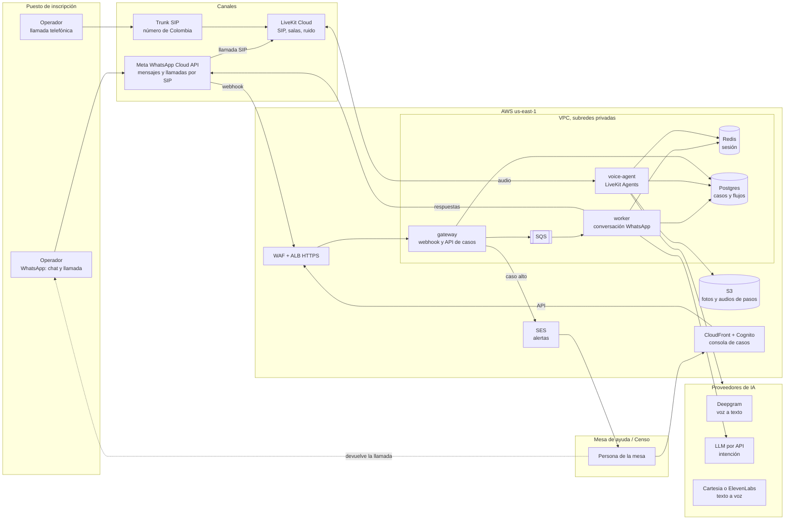
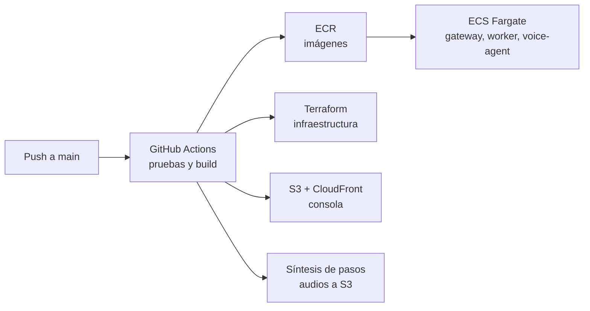

# Infraestructura del piloto

Qué hay que tener encendido para el asistente de WhatsApp, el agente de voz y la consola de casos de la mesa de ayuda. Comportamiento del agente en [analisis-agente-voz.md](analisis-agente-voz.md).

## Diagrama



Versión en imagen: [diagramas/infraestructura.png](diagramas/infraestructura.png).

En el dibujo no aparecen Secrets Manager, CloudWatch ni el NAT Gateway, que usan todos los servicios de la VPC: los secretos de cada proveedor, los logs y alarmas, y la salida hacia Meta, LiveKit y los proveedores de IA.

## Piezas

| Pieza | Qué hace | Por qué así |
| --- | --- | --- |
| `gateway` (ECS Fargate) | Recibe el webhook de WhatsApp, responde 200 de inmediato y deja el mensaje en SQS. Expone la API de la consola de casos. | Meta reintenta si el webhook tarda; el procesamiento va aparte. |
| `worker` (ECS Fargate) | Corre la conversación de WhatsApp: motor de flujos, clasificación con el LLM, envío de respuestas, creación de casos. | Escala con la cola, no con el tráfico HTTP. |
| `voice-agent` (ECS Fargate) | Proceso de LiveKit Agents. Cada llamada es una sesión: escucha, interpreta, habla, lee el teclado, crea el caso. | Se conecta hacia LiveKit Cloud por WebSocket saliente, así que no necesita puertos abiertos ni IP pública. |
| Motor de flujos | Librería compartida por `worker` y `voice-agent`. Lee los YAML de los tres casos. | Un solo árbol para chat y voz. |
| LiveKit Cloud | Recibe el SIP de Meta y del trunk, mezcla audio, cancela ruido y despacha la llamada a un `voice-agent` libre. | Evita operar un servidor SIP y media propio en el piloto. |
| Trunk SIP | Número de Colombia para quien llame sin WhatsApp. | Twilio, Telnyx, Plivo o un operador local; se elige por precio del DID y cobertura. |
| ElastiCache Redis | Sesión por teléfono: caso, paso, intentos. Vence en horas. | Permite retomar si la llamada se corta o si pasa del chat a la voz. |
| RDS Postgres | Casos, historial enmascarado, versiones de flujos, métricas. | Una sola base para agente, consola e indicadores. |
| S3 | Fotos de WhatsApp y audio presintetizado de cada paso. Retención acotada. | Los pasos fijos se sintetizan una vez y no suman latencia. |
| CloudFront + Cognito | Consola web de la mesa, con usuario y contraseña por persona. | La mesa no tiene herramienta; esta es su bandeja. |
| SES | Correo a la mesa (y a Dirección de Censo) cuando entra un caso alto. | Aviso aunque nadie tenga la consola abierta. |
| Secrets Manager, CloudWatch | Tokens de Meta, LiveKit, Deepgram, LLM y TTS. Logs con cédula enmascarada, alarmas. | — |

La región es `us-east-1` porque LiveKit Cloud, Deepgram y los modelos responden desde Estados Unidos; desde Colombia son entre 60 y 90 ms. Moverlo a São Paulo acerca la base pero aleja a los proveedores de voz, que es lo que más pesa en la latencia.

## Consola de casos

La mesa no tiene herramienta de casos. Opciones:

| Opción | A favor | En contra |
| --- | --- | --- |
| **Consola propia sobre el mismo Postgres** | Muestra lo que el agente ya sabe: pasos intentados, en cuál falló, transcripción enmascarada, fotos. Sin licencias ni integración. | Hay que construirla; se limita a lo que el piloto necesita. |
| GLPI | Mesa de ayuda completa, gratuita, con API REST conocida por el equipo. SLA, grupos, notificaciones. | Interfaz pesada para un caso de campo. Hay que mapear el caso del agente a su ticket. |
| Zammad | Mesa de ayuda moderna y gratuita, buena para atención en tiempo real, con API. | Otra plataforma más que operar; su canal de WhatsApp choca con el nuestro y no se usaría. |
| ClickUp (lo menciona el PDF) | Rápido de montar, API sencilla. | Es gestión de tareas, no mesa de ayuda: sin cola por prioridad ni tiempos de atención. |

**Recomendación:** consola propia para el piloto. El caso ya vive en nuestra base y lo que la mesa necesita es poco. Si después piden una mesa de ayuda formal, el `gateway` crea el mismo caso en GLPI por API y la consola queda como vista del agente.

Lo que tiene la consola en el piloto:

- Cola ordenada por prioridad y por tiempo esperando.
- Detalle del caso: puesto, número que llamó, cédula enmascarada, síntoma, pasos intentados, transcripción y fotos.
- Tomar el caso, para que dos personas no llamen al mismo operador.
- Botón de llamar, que abre la llamada normal o la de WhatsApp desde el celular de la mesa. No hace falta telefonía nueva.
- Cerrar con causa (resuelto en la llamada, tableta reemplazada, enviado a Censo) y notas.
- Aviso en el navegador y por correo cuando entra un caso alto.
- Rol de Dirección de Censo: solo ve los casos de huella y credenciales.

Los indicadores básicos (resueltos por el agente, escalados, tiempo de espera hasta que la mesa toma el caso) salen de la misma base y van en una pestaña de la consola.

## Dimensionamiento sin datos de volumen

No hay cifras de pico, así que la infraestructura arranca chica y escala sola:

- `voice-agent`: mínimo 2 tareas (una por zona de disponibilidad), autoescalado por llamadas activas.
- `worker`: 1 tarea mínima, autoescalado por mensajes en cola.
- Redis y Postgres en el tamaño más chico, ampliables sin cambiar código.

Para estimar llamadas simultáneas:

```text
llamadas simultáneas ≈ puestos × incidencias por puesto por hora × minutos por llamada ÷ 60
```

Ejemplo ilustrativo: 500 puestos, 0,2 incidencias por puesto por hora y 6 minutos por llamada dan unas 10 llamadas a la vez. La prueba mide los minutos por llamada reales; los puestos y la tasa de incidencias los tiene que dar el cliente antes del piloto en campo.

Los límites de concurrencia que importan están en los planes de LiveKit Cloud, Deepgram y el TTS, no en AWS. Se fijan cuando se conozca el volumen.

Si todos los `voice-agent` están ocupados, la llamada no queda sonando: un mensaje grabado avisa que se dejó un caso, el operador recibe el número por WhatsApp y la mesa lo llama.

## Despliegue



Dos ambientes: `dev`, compartido y con números de prueba, y `piloto`, con el número real de WhatsApp y el DID. Cuando procesos cambia el texto de un paso, el pipeline vuelve a sintetizar ese audio.

## Fuera del piloto

- Pasar la llamada en vivo a la mesa.
- Integración con inventario de tabletas y con Dirección de Censo por API.
- Guía offline en la app de la tableta.
- LiveKit y modelos dentro de la VPC (solo si aparece una restricción de datos).
